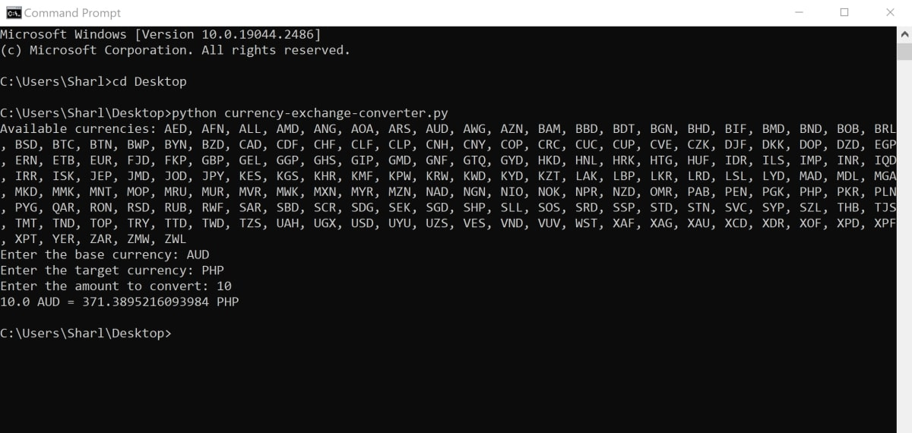

# python-currency-converter
This is a Python script that uses the Open Exchange Rates API to get currency data, to convert two currencies.

## To Run

* Navigate to the python-currency-converter folder in the command line or terminal.
* Run the script using the python command: python currency-exchange-converter.py

## Example

